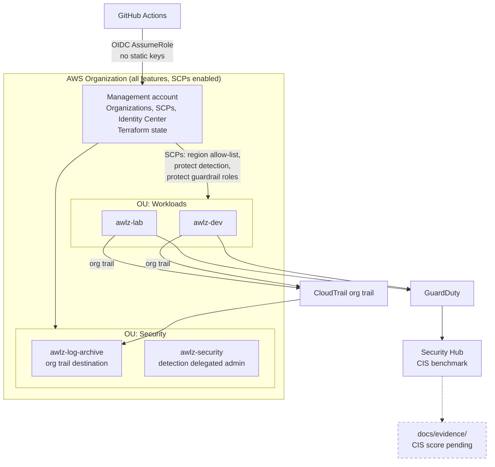
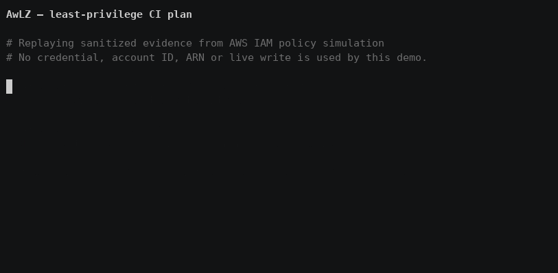

# AwLZ — AWS Landing Zone

Multi-account AWS landing zone built with Terraform: guardrails by default, zero long-lived credentials, and compliance evidence that is produced rather than claimed.

> **Status:** every stack is applied against a live AWS organization. The first closed billing window was measured on 2026-08-04, so cost is now an actual rather than a projection — with the trial-masked lines named as such. GuardDuty and Security Hub are still inside their trials until late August, so September 2026 is the first representative month. The [roadmap](#roadmap) marks exactly what exists.

---

## Why

Most "AWS security" portfolios harden a single account. Real organizations fail at the boundary — an account nobody governs, a region nobody watches, an access key in a CI runner. This repo builds the boundary itself: Organizations, SCPs, org-wide logging, detection, as reproducible code.

The deliverable is not working infrastructure. It is reproducible infrastructure **plus the evidence that the controls do what the documentation says**. See [`docs/evidence/`](docs/evidence/).

## Architecture



Dashed = not yet produced. Decisions and their consequences: [docs/architecture.md](docs/architecture.md). Current state, open items and the traps already hit: [docs/AwLZ-handbook.md](docs/AwLZ-handbook.md).

## Threat model

Summary — full version with likelihood, impact and residual risk in [docs/threat-model.md](docs/threat-model.md).

| # | Threat | Control | Status |
|---|--------|---------|--------|
| T1 | CI credential theft → account takeover | GitHub OIDC, no static keys, role trust pinned to exact `sub` claims | **applied**, `live/ci-oidc` |
| T2 | Attacker disables logging to hide activity | SCP denies destroying CloudTrail/Config/GuardDuty/Security Hub | **applied**, `live/guardrails` |
| T3 | Resource sprawl in unmonitored regions | SCP region allow-list | **applied + verified** |
| T4 | Log tampering or deletion | Dedicated log-archive account, CMK held there, Object Lock COMPLIANCE | **applied + verified** |
| T5 | Privilege escalation via IAM in member accounts | SCP denies IAM writes on guardrail roles | **partial** — permission boundaries still missing |
| T6 | Terraform state exfiltration | S3 + customer-managed KMS key, TLS-only policy, native S3 locking | **applied** |
| T6b | State object read or overwritten untraced | CloudTrail S3 data events scoped to the state bucket | **closed** |
| T7 | Malicious or typo'd Terraform merged | `tflint` + `trivy config` + `checkov`, real plan on PR, gated apply | **applied** — ruleset requires a PR and passing checks on `main` |
| T8 | Guardrails lock out emergency access | Break-glass role, documented and alarmed | **partial** — path exercised, no alarm |
| T9 | Member account root used outside Identity Center | Root credentials **deleted** from member accounts | **eliminated**, `live/org-root` |

## Layout

```
live/bootstrap/    remote state: S3 + KMS CMK, native locking      applied
live/org-root/     OUs, member accounts, centralized root access   applied
live/guardrails/   creates and attaches the SCPs                   applied
policies/scp/      the SCP documents
live/logging/      org trail into an object-locked archive account   applied
live/detection/    GuardDuty, Security Hub, Config, Access Analyzer  applied
live/ci-oidc/      GitHub OIDC provider + plan and apply roles       applied
modules/           logging, detection, config-recorder, iam-oidc
docs/              architecture, threat model, cost, evidence
```

Every stack under `live/` is a root module with pinned provider versions, a partial S3 backend, and `allowed_account_ids` set so a wrong profile fails instead of applying.

## Running it

Local auth is IAM Identity Center. There are no static access keys anywhere in this repo, by design.

```bash
aws sso login --profile mgmt
cd live/<stack>
cp example.tfvars terraform.tfvars      # account id, profile
cp example.backend.hcl backend.hcl      # state bucket, KMS key
terraform init -backend-config=backend.hcl
terraform plan -var-file=terraform.tfvars -out=tfplan
terraform apply tfplan
```

`live/bootstrap` is the exception — it creates the bucket it later stores its own state in, so its first run uses a local backend and then migrates. Procedure in [live/bootstrap/README.md](live/bootstrap/README.md).

State lives in the **management** account, not the security account. That is a deliberate trade-off, recorded as ADR-004.

## CI gates

| Gate | Tool | Status |
|------|------|--------|
| Format + lint | `terraform fmt -check`, `tflint --recursive` | running |
| Static security | `trivy config`, `checkov` | running |
| Validate | `terraform init -backend=false` + `validate`, per stack | running |
| Plan on PR | `terraform plan` against real AWS, read-only OIDC role | running |
| Gated apply | `production` environment, `main` only | role exists; workflow step not wired yet |

Current gate baseline across all stacks: **0 findings** — checkov 477 passed / 0 failed / 69 skipped, trivy and tflint clean. Every suppression carries its reason inline and, where the finding is real, a threat-model ID and the stack that closes it.

Third-party actions are pinned to commit SHAs rather than tags. A tag is mutable — whoever controls the action repository can repoint it at new code, which is T7 arriving through the back door.

The plan job assumes a **read-only** role whose trust policy pins the `sub` claim with `StringEquals`, not `StringLike`. `repo:owner/name:*` would also match a fork's pull request, which is the one path that must never hold credentials. It is denied state writes and runs with `-lock=false`, so a failed run cannot leave a lock for someone to force-unlock.

## Evidence

[docs/evidence/scp-verification.md](docs/evidence/scp-verification.md) — each SCP probed from inside a member account as an account administrator, since an SCP is the only thing that can deny one. Includes a negative control showing the role policy is scoped rather than blanket, and an incident where a guardrail correctly blocked cleanup of a mistake.

[docs/evidence/logging-verification.md](docs/evidence/logging-verification.md) — the org trail delivering: a real log object under the organization prefix, and CloudWatch streams from more than one account.

[docs/evidence/detection-verification.md](docs/evidence/detection-verification.md) — five Config recorders reporting `SUCCESS`, which is what proves the whole cross-account, CMK-encrypted delivery path works. Also states plainly what is *not* yet verified.

[docs/evidence/cis-score.txt](docs/evidence/cis-score.txt) — CIS v3.0.0 per account, regenerated by `make evidence`. Passed / (passed + failed + unknown), suppressed findings excluded, "no data" out of the denominator.

**Cost actuals — measured 2026-08-04.** The July window closed and Cost Explorer returned `Estimated: false`. July's gross usage was **USD 1.4830**, of which Config was USD 0.9970 (325 configuration items + 22 rule evaluations, reconciling exactly against the published rate). Credits covered all of it, so the *invoice* was USD 0 — and reporting that number alone would understate the model by its entire subject. August is the first uncredited month; the run rate is **USD 6.38/month** (AwLZ 4.67, PontoAntiCrack 1.40, tax 0.31) against a USD 20 ceiling. Full breakdown and the delta against the superseded projection: [docs/cost.md](docs/cost.md).

The measurement itself had a trap worth stating, because it produced a wrong answer first: **grouping Cost Explorer by `SERVICE` without filtering `RECORD_TYPE` sums credits into the same row as usage.** Under that grouping every service in this organization reads USD 0, and a Config recorder that was healthily recording 325 items looks either broken or free. It was neither.

**On "before vs after":** the guardrails went in before Security Hub did, so there is no honest organization-wide "before" left. `awlz-lab` was run as a control group instead — measured with its SCPs, without them, and after reattachment. The result is a negative one and is reported as such: the CIS score is identical control by control, because no CIS v3.0.0 control reads an SCP. The behavioural probes in the SCP evidence are what show the guardrail working.

## Demo



A replay of a real IAM policy simulation against `awlz-gha-plan-readonly`, the
role CI assumes in each member account. It shows the read succeeding and the
write refused by the permissions boundary.

What it proves: the plan role can refresh live state and cannot reconfigure
detection. What it does not prove: anything about the apply role, which is a
separate identity gated on the `production` environment. The driver makes no
AWS call — the decisions come from
[docs/evidence/ci-readonly-simulation.json](docs/evidence/ci-readonly-simulation.json),
captured live and committed. The raw cast is beside the GIF.

## Cost

[docs/cost.md](docs/cost.md). Hard ceiling USD 20/month; alerts at 85% and 100%
actual plus 100% forecast.

| | USD/month |
|---|---:|
| July 2026, gross usage (closed window, `Estimated: false`) | 1.4830 |
| July 2026, net invoiced after credits | 0.0000 |
| August 2026 run rate — AwLZ | 4.67 |
| August 2026 run rate — PontoAntiCrack at rest | 1.40 |
| Tax | 0.31 |
| **August run rate, joint** | **6.38** |

Against the 2026-07-30 projection of USD 13.73 for the same steady state, the
model was wrong in two directions and both are recorded rather than quietly
corrected:

- **KMS matched exactly** at USD 4.00 for four keys. It is the only line the
  first closed window confirmed outright.
- **Config was over-projected** at USD 3.12 because the estimate extrapolated a
  *deployment* day across a month. Config bills per configuration item and per
  rule evaluation, and the boundary rules are change-triggered — so a month in
  which nothing changes bills nothing. August has recorded zero items so far.
  Neither USD 3.12 nor USD 0 is the steady state, and one closed month cannot
  produce that number.
- **Secrets Manager was missing from the model entirely** at USD 0.40/month.

Two things still hide the real figure: **GuardDuty's 30-day trial ends around
2026-08-27**, and Security Hub is inside its own. `get-cost-forecast` returns
`DataUnavailableException` — the organization is too young to forecast.
**September 2026 is the first representative month**, and nothing before it
should be quoted as steady state.

## Roadmap

- [x] `live/bootstrap` — remote state, KMS CMK, native S3 locking
- [x] `live/org-root` — OUs, member accounts, centralized root access
- [x] `policies/scp` + `live/guardrails` — region allow-list, protect detection, protect guardrail roles
- [x] CI: fmt / tflint / trivy / checkov
- [x] `live/logging` — org trail → S3 with CMK + Object Lock in the log-archive account
- [x] `live/ci-oidc` — GitHub OIDC provider + plan and apply roles
- [x] CI: real `terraform plan` on PR against AWS
- [x] `live/detection` — GuardDuty, Config, Security Hub + CIS, delegated to `awlz-security`
- [ ] Wire the gated apply job to the `production` environment
- [x] Permission boundaries + Config rule for T5
- [x] Alarm on break-glass role assumption (T8)
- [x] Read-only plan role per member account; all six stacks planned in CI without administrator
- [x] CIS score via the `awlz-lab` control group
- [x] Demo recording
- [x] Cost actuals — July window closed, measured 2026-08-04
- [ ] September actual — first month outside the GuardDuty and Security Hub trials

## Toolchain

terraform 1.15.8, tflint 0.64.0, trivy 0.72.0, checkov 3.3.8, aws-cli 2.36.9. Provider pinned to `hashicorp/aws` 6.56.0 via committed lock files. Setup notes: [docs/toolchain.md](docs/toolchain.md).
