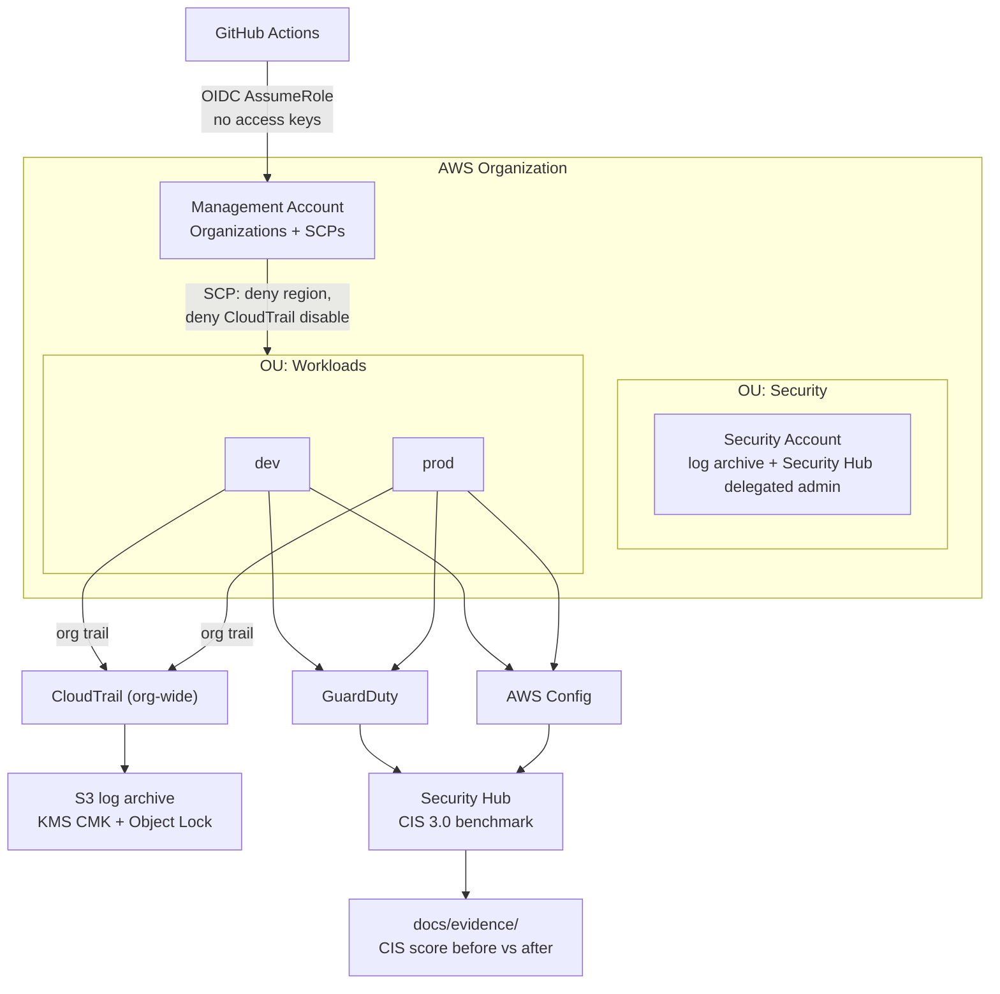

# Aegis Landing Zone

Multi-account AWS landing zone built with Terraform: guardrails by default, zero long-lived credentials, and continuous compliance evidence.

> **Status:** scaffolding. See [Roadmap](#roadmap) for what is implemented.

---

## Why

Most "AWS security" portfolios show a hardened single account. Real organizations fail at the boundary: an account nobody governs, a region nobody watches, an access key in a CI runner. This repo builds the boundary itself — Organizations, SCPs, org-wide logging, and detection — as reproducible code with compliance evidence attached.

## Architecture



Full diagram and decisions: [docs/architecture.md](docs/architecture.md).

## Threat model

Summary — full version in [docs/threat-model.md](docs/threat-model.md).

| # | Threat | Control | Where |
|---|--------|---------|-------|
| T1 | CI credential theft → account takeover | GitHub OIDC federation, no static keys, role scoped by `sub` claim | `modules/iam-oidc` |
| T2 | Attacker disables logging to hide activity | SCP denies `cloudtrail:StopLogging`/`DeleteTrail`; S3 Object Lock (compliance mode) | `policies/scp`, `modules/logging` |
| T3 | Resource sprawl in unmonitored regions | SCP denies all actions outside allowed regions | `policies/scp` |
| T4 | Log tampering / deletion | Dedicated log-archive account, KMS CMK with restrictive key policy, versioning + Object Lock | `modules/logging` |
| T5 | Privilege escalation via IAM in member accounts | SCP denies changes to guardrail roles; permission boundaries | `policies/scp`, `modules/iam-oidc` |
| T6 | Terraform state exfiltration (state holds secrets/ARNs) | Encrypted remote state, DynamoDB lock, state bucket in security account | `live/bootstrap` |
| T7 | Malicious/typo'd Terraform merged to main | `tflint` + `tfsec` + `checkov` gates in CI, plan-only on PR, apply on protected branch | `.github/workflows` |

## Layout

```
live/           # root modules per account/stage (bootstrap, org-root, security, workload-dev)
modules/        # reusable modules (organizations, scp, iam-oidc, logging, detection, config-rules)
policies/scp/   # service control policies as JSON
tests/          # policy + module tests
docs/           # architecture, threat model, cost, evidence
```

## Bootstrap

```bash
make bootstrap
```

Creates the remote state bucket + lock table in the security account; everything after uses that backend.

## CI gates

| Gate | Tool | Blocking |
|------|------|----------|
| Format + lint | `terraform fmt`, `tflint` | yes |
| Static security | `tfsec`, `checkov` | yes |
| Plan | `terraform plan` on PR, artifact attached | yes |
| Apply | manual approval, `main` only, OIDC role | — |

## Cost

Estimated monthly cost of the whole landing zone, per account tier: [docs/cost.md](docs/cost.md). Target: keep the demo org runnable under a hard budget with CloudWatch billing alarms.

## Evidence

CIS AWS Foundations Benchmark score **before vs after**, exported from Security Hub: [docs/evidence/](docs/evidence/).

## Demo


<!-- GIF: apply → SCP blocks a denied-region API call → Security Hub score jumps -->

## Roadmap

- [ ] `live/bootstrap` — remote state + lock
- [ ] `modules/organizations` — OUs, account factory
- [ ] `policies/scp` — region deny, CloudTrail protect, root user deny
- [ ] `modules/iam-oidc` — GitHub OIDC provider + scoped roles
- [ ] `modules/logging` — org trail → S3 (KMS, Object Lock) in security account
- [ ] `modules/detection` — GuardDuty, Config, Security Hub + CIS
- [ ] CI: fmt/tflint/tfsec/checkov/plan
- [ ] `docs/cost.md` + CIS before/after evidence
- [ ] Demo GIF

## Local tooling

Not yet installed on the dev workstation: `terraform`, `tflint`, `tfsec`, `checkov`, `aws` CLI. See [docs/toolchain.md](docs/toolchain.md).
