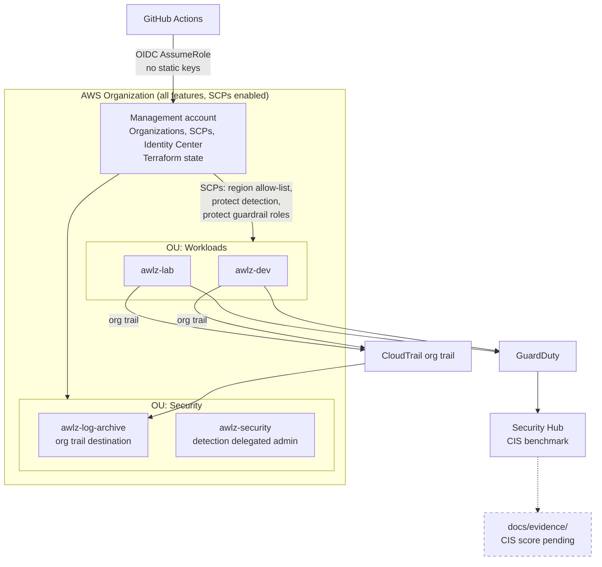

# AwLZ — AWS Landing Zone

Multi-account AWS landing zone built with Terraform: guardrails by default, zero long-lived credentials, and compliance evidence that is produced rather than claimed.

> **Status:** every stack is applied against a live AWS organization. Detection landed on 2026-07-28, so CIS scores and cost actuals are still accumulating — those two are marked pending below rather than guessed at. The [roadmap](#roadmap) marks exactly what exists.

---

## Why

Most "AWS security" portfolios harden a single account. Real organizations fail at the boundary — an account nobody governs, a region nobody watches, an access key in a CI runner. This repo builds the boundary itself: Organizations, SCPs, org-wide logging, detection, as reproducible code.

The deliverable is not working infrastructure. It is reproducible infrastructure **plus the evidence that the controls do what the documentation says**. See [`docs/evidence/`](docs/evidence/).

## Architecture



Dashed = not yet produced. Decisions and their consequences: [docs/architecture.md](docs/architecture.md). Current state, open items and the traps already hit: [docs/project-handbook.md](docs/project-handbook.md).

## Threat model

Summary — full version with likelihood, impact and residual risk in [docs/threat-model.md](docs/threat-model.md).

| # | Threat | Control | Status |
|---|--------|---------|--------|
| T1 | CI credential theft → account takeover | GitHub OIDC, no static keys, role trust pinned to exact `sub` claims | **applied**, `live/ci-oidc` |
| T2 | Attacker disables logging to hide activity | SCP denies destroying CloudTrail/Config/GuardDuty/Security Hub | **applied**, `live/guardrails` |
| T3 | Resource sprawl in unmonitored regions | SCP region allow-list | **applied + verified** |
| T4 | Log tampering or deletion | Dedicated log-archive account, CMK held there, Object Lock COMPLIANCE | **applied + verified** |
| T5 | Privilege escalation via IAM in member accounts | SCP denies IAM writes on guardrail roles | **partial** — permission boundaries still missing |
| T6 | Terraform state exfiltration | S3 + customer-managed KMS key, TLS-only policy, native S3 locking | **applied** |
| T6b | State object read or overwritten untraced | CloudTrail S3 data events scoped to the state bucket | **closed** |
| T7 | Malicious or typo'd Terraform merged | `tflint` + `trivy config` + `checkov`, real plan on PR, gated apply | **applied** — ruleset requires a PR and passing checks on `main` |
| T8 | Guardrails lock out emergency access | Break-glass role, documented and alarmed | **partial** — path exercised, no alarm |
| T9 | Member account root used outside Identity Center | Root credentials **deleted** from member accounts | **eliminated**, `live/org-root` |

## Layout

```
live/bootstrap/    remote state: S3 + KMS CMK, native locking      applied
live/org-root/     OUs, member accounts, centralized root access   applied
live/guardrails/   creates and attaches the SCPs                   applied
policies/scp/      the SCP documents
live/logging/      org trail into an object-locked archive account   applied
live/detection/    GuardDuty, Security Hub, Config, Access Analyzer  applied
live/ci-oidc/      GitHub OIDC provider + plan and apply roles       applied
modules/           logging, detection, config-recorder, iam-oidc
docs/              architecture, threat model, cost, evidence
```

Every stack under `live/` is a root module with pinned provider versions, a partial S3 backend, and `allowed_account_ids` set so a wrong profile fails instead of applying.

## Running it

Local auth is IAM Identity Center. There are no static access keys anywhere in this repo, by design.

```bash
aws sso login --profile mgmt
cd live/<stack>
cp example.tfvars terraform.tfvars      # account id, profile
cp example.backend.hcl backend.hcl      # state bucket, KMS key
terraform init -backend-config=backend.hcl
terraform plan -var-file=terraform.tfvars -out=tfplan
terraform apply tfplan
```

`live/bootstrap` is the exception — it creates the bucket it later stores its own state in, so its first run uses a local backend and then migrates. Procedure in [live/bootstrap/README.md](live/bootstrap/README.md).

State lives in the **management** account, not the security account. That is a deliberate trade-off, recorded as ADR-004.

## CI gates

| Gate | Tool | Status |
|------|------|--------|
| Format + lint | `terraform fmt -check`, `tflint --recursive` | running |
| Static security | `trivy config`, `checkov` | running |
| Validate | `terraform init -backend=false` + `validate`, per stack | running |
| Plan on PR | `terraform plan` against real AWS, read-only OIDC role | running |
| Gated apply | `production` environment, `main` only | role exists; workflow step not wired yet |

Current gate baseline across all stacks: **0 findings** — checkov 376 passed / 0 failed / 21 skipped, trivy and tflint clean. Every suppression carries its reason inline and, where the finding is real, a threat-model ID and the stack that closes it.

Third-party actions are pinned to commit SHAs rather than tags. A tag is mutable — whoever controls the action repository can repoint it at new code, which is T7 arriving through the back door.

The plan job assumes a **read-only** role whose trust policy pins the `sub` claim with `StringEquals`, not `StringLike`. `repo:owner/name:*` would also match a fork's pull request, which is the one path that must never hold credentials. It is denied state writes and runs with `-lock=false`, so a failed run cannot leave a lock for someone to force-unlock.

## Evidence

[docs/evidence/scp-verification.md](docs/evidence/scp-verification.md) — each SCP probed from inside a member account as an account administrator, since an SCP is the only thing that can deny one. Includes a negative control showing the role policy is scoped rather than blanket, and an incident where a guardrail correctly blocked cleanup of a mistake.

[docs/evidence/logging-verification.md](docs/evidence/logging-verification.md) — the org trail delivering: a real log object under the organization prefix, and CloudWatch streams from more than one account.

[docs/evidence/detection-verification.md](docs/evidence/detection-verification.md) — five Config recorders reporting `SUCCESS`, which is what proves the whole cross-account, CMK-encrypted delivery path works. Also states plainly what is *not* yet verified.

**Pending, not claimed:** the CIS score and cost actuals. Detection was applied on 2026-07-28; Security Hub provisions controls over ~24 hours and Cost Explorer has no data for a new organization. A number produced today would be an artifact of timing.

**On "before vs after":** the guardrails went in before Security Hub did, so there is no honest organization-wide "before" left. The replacement is `awlz-lab` as a control group — detach its SCPs, score it, reattach, score again — which measures what the guardrails actually buy. Reasoning in the detection evidence.

## Cost

[docs/cost.md](docs/cost.md). Governance-only footprint against a hard USD 20/month budget with alerts at 85% and 100%. Home region `sa-east-1` runs 30–50% above `us-east-1`; deliberate, for data residency.

## Roadmap

- [x] `live/bootstrap` — remote state, KMS CMK, native S3 locking
- [x] `live/org-root` — OUs, member accounts, centralized root access
- [x] `policies/scp` + `live/guardrails` — region allow-list, protect detection, protect guardrail roles
- [x] CI: fmt / tflint / trivy / checkov
- [x] `live/logging` — org trail → S3 with CMK + Object Lock in the log-archive account
- [x] `live/ci-oidc` — GitHub OIDC provider + plan and apply roles
- [x] CI: real `terraform plan` on PR against AWS
- [x] `live/detection` — GuardDuty, Config, Security Hub + CIS, delegated to `awlz-security`
- [ ] Wire the gated apply job to the `production` environment
- [ ] Permission boundaries + Config rule for T5
- [ ] Alarm on break-glass role assumption (T8)
- [ ] CIS score via the `awlz-lab` control group; cost actuals after a billing cycle
- [ ] Demo recording

## Toolchain

terraform 1.15.8, tflint 0.64.0, trivy 0.72.0, checkov 3.3.8, aws-cli 2.36.9. Provider pinned to `hashicorp/aws` 6.56.0 via committed lock files. Setup notes: [docs/toolchain.md](docs/toolchain.md).
