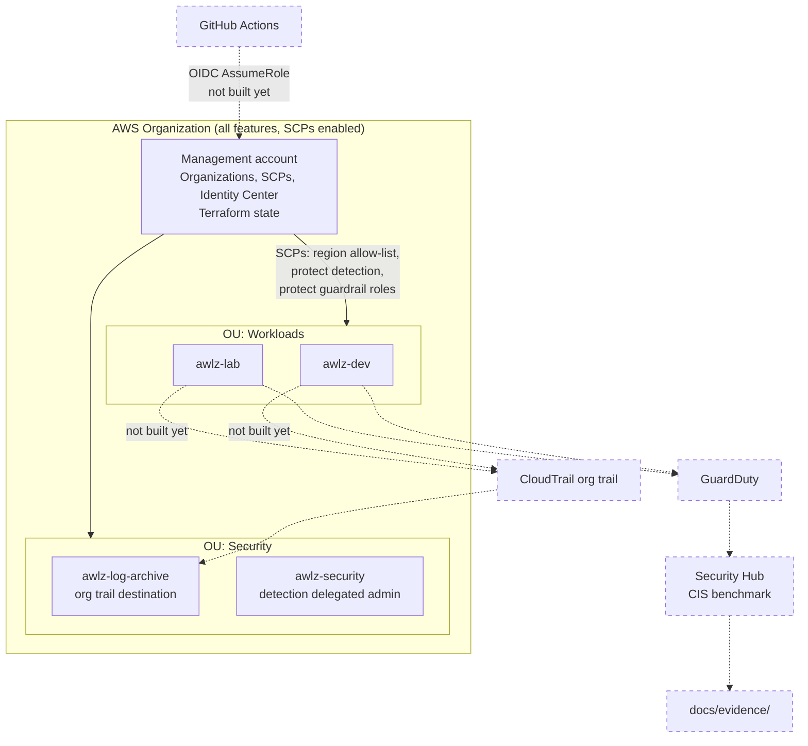

# AwLZ — AWS Landing Zone

Multi-account AWS landing zone built with Terraform: guardrails by default, zero long-lived credentials, and compliance evidence that is produced rather than claimed.

> **Status:** organization, guardrails and remote state are applied and verified against a live AWS organization. Logging, CI federation and detection are not built yet. The [roadmap](#roadmap) marks exactly what exists.

---

## Why

Most "AWS security" portfolios harden a single account. Real organizations fail at the boundary — an account nobody governs, a region nobody watches, an access key in a CI runner. This repo builds the boundary itself: Organizations, SCPs, org-wide logging, detection, as reproducible code.

The deliverable is not working infrastructure. It is reproducible infrastructure **plus the evidence that the controls do what the documentation says**. See [`docs/evidence/`](docs/evidence/).

## Architecture



Dashed = not built yet. Decisions and their consequences: [docs/architecture.md](docs/architecture.md).

## Threat model

Summary — full version with likelihood, impact and residual risk in [docs/threat-model.md](docs/threat-model.md).

| # | Threat | Control | Status |
|---|--------|---------|--------|
| T1 | CI credential theft → account takeover | GitHub OIDC, no static keys, role scoped by `sub` claim | not built — `modules/iam-oidc` |
| T2 | Attacker disables logging to hide activity | SCP denies destroying CloudTrail/Config/GuardDuty/Security Hub | **applied**, `live/guardrails` |
| T3 | Resource sprawl in unmonitored regions | SCP region allow-list | **applied + verified** |
| T4 | Log tampering or deletion | Dedicated log-archive account, KMS CMK, Object Lock | not built — `modules/logging` |
| T5 | Privilege escalation via IAM in member accounts | SCP denies IAM writes on guardrail roles | **partial** — permission boundaries still missing |
| T6 | Terraform state exfiltration | S3 + customer-managed KMS key, TLS-only policy, native S3 locking | **applied** |
| T6b | State object read or overwritten untraced | Versioning + CloudTrail; S3 access logging | **open** — needs `modules/logging` |
| T7 | Malicious or typo'd Terraform merged | `tflint` + `trivy config` + `checkov`, plan on PR, gated apply | **partial** — gates run, branch protection not configured |
| T8 | Guardrails lock out emergency access | Break-glass role, documented and alarmed | **partial** — path exercised, no alarm |
| T9 | Member account root used outside Identity Center | Root credentials **deleted** from member accounts | **eliminated**, `live/org-root` |

## Layout

```
live/bootstrap/    remote state: S3 + KMS CMK, native locking      applied
live/org-root/     OUs, member accounts, centralized root access   applied
live/guardrails/   creates and attaches the SCPs                   applied
policies/scp/      the SCP documents
modules/           logging, iam-oidc, detection, config-rules      not built
docs/              architecture, threat model, cost, evidence
```

Every stack under `live/` is a root module with pinned provider versions, a partial S3 backend, and `allowed_account_ids` set so a wrong profile fails instead of applying.

## Running it

Local auth is IAM Identity Center. There are no static access keys anywhere in this repo, by design.

```bash
aws sso login --profile mgmt
cd live/<stack>
cp example.tfvars terraform.tfvars      # account id, profile
cp example.backend.hcl backend.hcl      # state bucket, KMS key
terraform init -backend-config=backend.hcl
terraform plan -var-file=terraform.tfvars -out=tfplan
terraform apply tfplan
```

`live/bootstrap` is the exception — it creates the bucket it later stores its own state in, so its first run uses a local backend and then migrates. Procedure in [live/bootstrap/README.md](live/bootstrap/README.md).

State lives in the **management** account, not the security account. That is a deliberate trade-off, recorded as ADR-004.

## CI gates

| Gate | Tool | Status |
|------|------|--------|
| Format + lint | `terraform fmt`, `tflint` | running |
| Static security | `trivy config`, `checkov` | running |
| Plan on PR | `terraform plan` | stubbed — waiting on OIDC role |
| Gated apply | manual approval, `main` only | not configured |

Current gate baseline across applied stacks: **0 findings**, with six documented suppressions in `live/bootstrap` and none anywhere else. Every suppression carries its reason inline and, where the finding is real, a threat-model ID and the stack that closes it.

## Evidence

[docs/evidence/scp-verification.md](docs/evidence/scp-verification.md) — each SCP probed from inside a member account as an account administrator, since an SCP is the only thing that can deny one. Includes a negative control showing the role policy is scoped rather than blanket, and an incident where a guardrail correctly blocked cleanup of a mistake.

Still to come: CIS benchmark score before vs after, cost actuals from a full billing cycle.

## Cost

[docs/cost.md](docs/cost.md). Governance-only footprint against a hard USD 20/month budget with alerts at 85% and 100%. Home region `sa-east-1` runs 30–50% above `us-east-1`; deliberate, for data residency.

## Roadmap

- [x] `live/bootstrap` — remote state, KMS CMK, native S3 locking
- [x] `live/org-root` — OUs, member accounts, centralized root access
- [x] `policies/scp` + `live/guardrails` — region allow-list, protect detection, protect guardrail roles
- [x] CI: fmt / tflint / trivy / checkov
- [ ] `modules/logging` — org trail → S3 with KMS + Object Lock in the log-archive account
- [ ] `modules/iam-oidc` — GitHub OIDC provider + scoped roles; unblocks plan-on-PR
- [ ] `modules/detection` — GuardDuty, Config, Security Hub + CIS, delegated to `awlz-security`
- [ ] Permission boundaries + Config rule for T5
- [ ] CIS score before/after, cost actuals
- [ ] Demo recording

## Toolchain

terraform 1.15.8, tflint 0.64.0, trivy 0.72.0, checkov 3.3.8, aws-cli 2.36.9. Provider pinned to `hashicorp/aws` 6.56.0 via committed lock files. Setup notes: [docs/toolchain.md](docs/toolchain.md).
